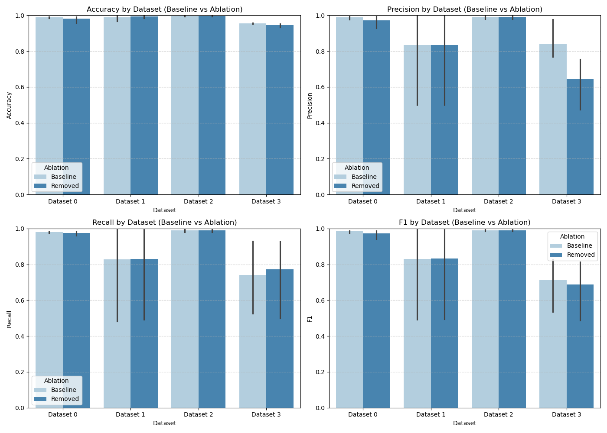
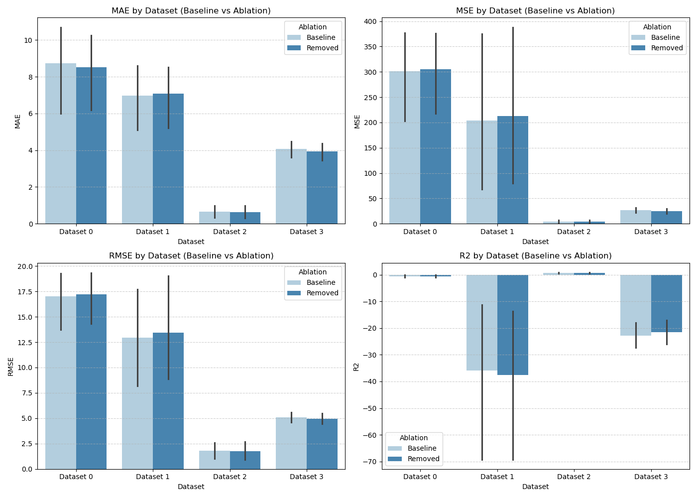

# GitHub PR 分析实验
整个流程主要通过 src/pipeline.py 完成，包括特征整合、划分训练/测试集、模型训练以及指标可视化。
### 数据与切分
- 数据预处理部分：
  1. 先对`vscode`、`pytorch`的数据分别进行合并
  2. 然后提取`vscode`、`pytorch`、`paddle`、`stockfish`中的特征分别存入对应的文件夹下
  3. 在执行pipeline时会再一次对特征做清洗和筛选
- 划分训练/测试集：
  - 由于不同项目的时间不同，没法统一一个时间进行划分，所以就简单地将数据集按照 4 : 1 的比例划分

### 特征工程概要
特征选择参考：/datas/feature.txt
清洗策略：统一时区转换、去除 inf、对缺失值使用平均值填充、过滤机器人的发言，在实际训练时会对回归和分类做一些针对性的筛选

### 运行实验
- `make integrate`：整合数据
- `make run` ： 运行pipeline
- `make run MODE=regressor` ： 只跑回归
- `make run MODE=classifier` : 只跑分类
- 特征消融实验，可以在src/config中修改配置
  - "enabled"项表示是否进行实验
  - 其余是准备好的特征供选择，作为参数传入 PipeLine 的 run 函数即可

运行完成后将在 outputs/ 目录得到：
- final_features 最终的特征数据
- classification
  - 分类各指标和消融实验结果
  - 分类各指标和消融实验可视化
- regression 回归各指标和消融实验可视化
  - 回归各指标和消融实验结果
  - 回归各指标和消融实验可视化

### 模型与指标
#### 任务一：时间预测 （单位：天）
| Model                  | Dataset   | MAE     | MSE      | RMSE    | R²       |
| ---------------------- | --------- | ------- | -------- | ------- | -------- |
| LinearRegression       | paddle    | 10.9265 | 331.6508 | 18.2113 | -0.7306  |
| LinearRegression       | stockfish | 7.8417  | 88.8080  | 9.4238  | -15.0970 |
| LinearRegression       | vscode    | 1.2625  | 10.2681  | 3.2044  | 0.3081   |
| LinearRegression       | pytorch   | 3.5269  | 19.2841  | 4.3914  | -16.3508 |
| RandomForest           | paddle    | 8.4598  | 376.5817 | 19.4057 | -0.9651  |
| RandomForest           | stockfish | 8.5338  | 265.6864 | 16.2999 | -47.1572 |
| RandomForest           | vscode    | 0.5861  | 3.2752   | 1.8098  | 0.7793   |
| RandomForest           | pytorch   | 4.3851  | 27.0388  | 5.1999  | -23.3280 |
| GradientBoosting       | paddle    | 9.8652  | 281.6659 | 16.7829 | -0.4698  |
| GradientBoosting       | stockfish | 9.0534  | 539.1688 | 23.2200 | -96.7276 |
| GradientBoosting       | vscode    | 0.3047  | 0.4212   | 0.6490  | 0.9716   |
| GradientBoosting       | pytorch   | 4.4303  | 30.1451  | 5.4905  | -26.1229 |
| HistGradientBoosting   | paddle    | 10.8597 | 399.5459 | 19.9886 | -1.0849  |
| HistGradientBoosting   | stockfish | 5.8366  | 71.8824  | 8.4783  | -12.0291 |
| HistGradientBoosting   | vscode    | 0.8707  | 5.7596   | 2.3999  | 0.6119   |
| HistGradientBoosting   | pytorch   | 4.5877  | 34.7842  | 5.8978  | -30.2969 |
| GradientBoosting_log1p | paddle    | 3.5580  | 116.6488 | 10.8004 | 0.3913   |
| GradientBoosting_log1p | stockfish | 3.5425  | 53.4255  | 7.3093  | -8.6837  |
| GradientBoosting_log1p | vscode    | 0.2122  | 0.8763   | 0.9361  | 0.9410   |
| GradientBoosting_log1p | pytorch   | 3.3706  | 20.8153  | 4.5624  | -17.7285 |

#### 任务二：合并预测
| Model              | Dataset   | Accuracy | Precision | Recall | F1     |
| ------------------ | --------- | -------- | --------- | ------ | ------ |
| LogisticRegression | paddle    | 0.9917   | 0.9947    | 0.9815 | 0.9879 |
| LogisticRegression | stockfish | 0.9667   | 0.5000    | 0.4833 | 0.4915 |
| LogisticRegression | vscode    | 0.9926   | 0.9794    | 0.9886 | 0.9839 |
| LogisticRegression | pytorch   | 0.9575   | 0.7700    | 0.9303 | 0.8282 |
| RandomForest       | paddle    | 0.9917   | 0.9947    | 0.9815 | 0.9879 |
| RandomForest       | stockfish | 1.0000   | 1.0000    | 1.0000 | 1.0000 |
| RandomForest       | vscode    | 0.9934   | 0.9912    | 0.9794 | 0.9852 |
| RandomForest       | pytorch   | 0.9525   | 0.9762    | 0.5250 | 0.5354 |
| GradientBoosting   | paddle    | 0.9833   | 0.9761    | 0.9761 | 0.9761 |
| GradientBoosting   | stockfish | 1.0000   | 1.0000    | 1.0000 | 1.0000 |
| GradientBoosting   | vscode    | 1.0000   | 1.0000    | 1.0000 | 1.0000 |
| GradientBoosting   | pytorch   | 0.9575   | 0.7777    | 0.7645 | 0.7709 |

### 特征消融
可视化见：和
